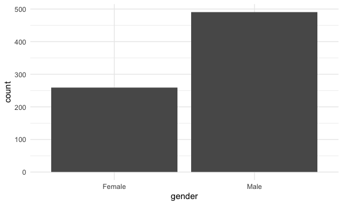
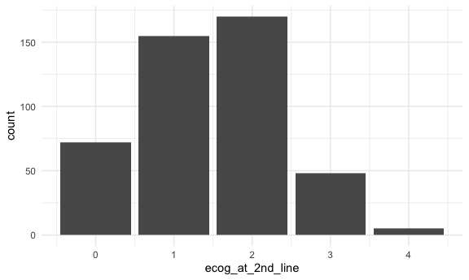
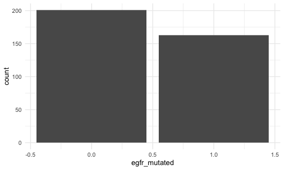

GBM Analysis
================
2022-10-26

## Importing csv file

Data was first imported, and names were cleaned. As there was no data
dictionary provided, the assumption was made that inputs of 999 and 9
indicated missing information. Therefore, all inputs of 999 and 9 were
converted into NA using `replace_with_na_all`.

``` r
gbm_data = read_csv(
  'data/gbm_patient_data.csv') %>%
  janitor::clean_names() %>%
  replace_with_na_all(condition = ~.x == 999) %>%
  replace_with_na_all(condition = ~.x == 9) 
```

    ## New names:
    ## Rows: 750 Columns: 42
    ## ── Column specification
    ## ──────────────────────────────────────────────────────── Delimiter: "," chr
    ## (11): COUNTRY, Gender, Race, Patient's level of involvement in GBM, Pati... dbl
    ## (31): MD_ID, PATIENT_ID, Line of therapy, Year of birth, Age at diagnosi...
    ## ℹ Use `spec()` to retrieve the full column specification for this data. ℹ
    ## Specify the column types or set `show_col_types = FALSE` to quiet this message.
    ## • `Comorbidity: Other (specify)` -> `Comorbidity: Other (specify)...28`
    ## • `Comorbidity: Other (specify)` -> `Comorbidity: Other (specify)...29`

``` r
skimr::skim(gbm_data)
```

|                                                  |          |
|:-------------------------------------------------|:---------|
| Name                                             | gbm_data |
| Number of rows                                   | 750      |
| Number of columns                                | 42       |
| \_\_\_\_\_\_\_\_\_\_\_\_\_\_\_\_\_\_\_\_\_\_\_   |          |
| Column type frequency:                           |          |
| character                                        | 11       |
| numeric                                          | 31       |
| \_\_\_\_\_\_\_\_\_\_\_\_\_\_\_\_\_\_\_\_\_\_\_\_ |          |
| Group variables                                  | None     |

Data summary

**Variable type: character**

| skim_variable                        | n_missing | complete_rate | min | max | empty | n_unique | whitespace |
|:-------------------------------------|----------:|--------------:|----:|----:|------:|---------:|-----------:|
| country                              |         0 |          1.00 |   2 |   2 |     0 |        1 |          0 |
| gender                               |         0 |          1.00 |   4 |   6 |     0 |        2 |          0 |
| race                                 |         0 |          1.00 |   5 |  23 |     0 |        5 |          0 |
| patients_level_of_involvement_in_gbm |         0 |          1.00 |  36 |  44 |     0 |        3 |          0 |
| patients_treatment_goals             |         0 |          1.00 |  24 |  31 |     0 |        2 |          0 |
| primary_insurance                    |        45 |          0.94 |   3 |  19 |     0 |        8 |          0 |
| comorbidity_other_specify_29         |       742 |          0.01 |   5 |  48 |     0 |        8 |          0 |
| regimen_in_1st_line                  |         0 |          1.00 |   5 |  20 |     0 |        8 |          0 |
| regimen_in_1st_line_other            |       748 |          0.00 |   9 |  10 |     0 |        2 |          0 |
| regimen_in_2nd_line                  |       300 |          0.60 |   5 |  20 |     0 |        8 |          0 |
| regimen_in_2nd_line_other            |       748 |          0.00 |  11 |  27 |     0 |        2 |          0 |

**Variable type: numeric**

| skim_variable                             | n_missing | complete_rate |      mean |       sd |     p0 |      p25 |      p50 |       p75 |   p100 | hist  |
|:------------------------------------------|----------:|--------------:|----------:|---------:|-------:|---------:|---------:|----------:|-------:|:------|
| md_id                                     |         0 |          1.00 |  12604.37 |  1128.96 |  10487 |  11439.0 |  13266.0 |  13462.00 |  13536 | ▂▁▁▁▇ |
| patient_id                                |         0 |          1.00 | 126046.73 | 11289.60 | 104871 | 114393.2 | 132663.0 | 134622.75 | 135365 | ▂▁▁▁▇ |
| line_of_therapy                           |         0 |          1.00 |      1.60 |     0.49 |      1 |      1.0 |      2.0 |      2.00 |      2 | ▅▁▁▁▇ |
| year_of_birth                             |         0 |          1.00 |   1957.90 |    12.03 |   1925 |   1950.0 |   1957.0 |   1966.00 |   1996 | ▁▆▇▃▁ |
| age_at_diagnosis                          |         0 |          1.00 |     56.90 |    12.23 |     19 |     48.0 |     57.0 |     65.75 |     88 | ▁▃▇▆▂ |
| adequate_caretaker_support                |        49 |          0.93 |      0.70 |     0.46 |      0 |      0.0 |      1.0 |      1.00 |      1 | ▃▁▁▁▇ |
| travel_time_to_your_office_30_min         |        46 |          0.94 |      0.42 |     0.49 |      0 |      0.0 |      0.0 |      1.00 |      1 | ▇▁▁▁▆ |
| comorbidity_renal_impairment              |         0 |          1.00 |      0.11 |     0.31 |      0 |      0.0 |      0.0 |      0.00 |      1 | ▇▁▁▁▁ |
| comorbidity_anemia                        |         0 |          1.00 |      0.16 |     0.36 |      0 |      0.0 |      0.0 |      0.00 |      1 | ▇▁▁▁▂ |
| comorbidity_copd_pulmonary                |         0 |          1.00 |      0.11 |     0.32 |      0 |      0.0 |      0.0 |      0.00 |      1 | ▇▁▁▁▁ |
| comorbidity_diabetes                      |         0 |          1.00 |      0.18 |     0.39 |      0 |      0.0 |      0.0 |      0.00 |      1 | ▇▁▁▁▂ |
| comorbidity_chf_cong_heart_failure        |         0 |          1.00 |      0.06 |     0.23 |      0 |      0.0 |      0.0 |      0.00 |      1 | ▇▁▁▁▁ |
| comorbidity_neuropathies                  |         0 |          1.00 |      0.06 |     0.24 |      0 |      0.0 |      0.0 |      0.00 |      1 | ▇▁▁▁▁ |
| comorbidity_other_neurological            |         0 |          1.00 |      0.02 |     0.15 |      0 |      0.0 |      0.0 |      0.00 |      1 | ▇▁▁▁▁ |
| comorbidity_hepatic_insufficiency         |         0 |          1.00 |      0.03 |     0.16 |      0 |      0.0 |      0.0 |      0.00 |      1 | ▇▁▁▁▁ |
| comorbidity_other_cytopenia               |         0 |          1.00 |      0.03 |     0.17 |      0 |      0.0 |      0.0 |      0.00 |      1 | ▇▁▁▁▁ |
| comorbidity_autoimmune_disorder           |         0 |          1.00 |      0.02 |     0.15 |      0 |      0.0 |      0.0 |      0.00 |      1 | ▇▁▁▁▁ |
| comorbidity_hypertension                  |         0 |          1.00 |      0.24 |     0.43 |      0 |      0.0 |      0.0 |      0.00 |      1 | ▇▁▁▁▂ |
| comorbidity_other_cardiovascular          |         0 |          1.00 |      0.06 |     0.24 |      0 |      0.0 |      0.0 |      0.00 |      1 | ▇▁▁▁▁ |
| comorbidity_alzheimers                    |         0 |          1.00 |      0.01 |     0.11 |      0 |      0.0 |      0.0 |      0.00 |      1 | ▇▁▁▁▁ |
| comorbidity_other_cancer_besides_gbm      |         0 |          1.00 |      0.02 |     0.13 |      0 |      0.0 |      0.0 |      0.00 |      1 | ▇▁▁▁▁ |
| comorbidity_other_specify_28              |         0 |          1.00 |      0.02 |     0.13 |      0 |      0.0 |      0.0 |      0.00 |      1 | ▇▁▁▁▁ |
| comorbidity_none                          |         0 |          1.00 |      0.47 |     0.50 |      0 |      0.0 |      0.0 |      1.00 |      1 | ▇▁▁▁▇ |
| ecog_at_1st_line                          |         0 |          1.00 |      1.28 |     1.14 |      0 |      1.0 |      1.0 |      2.00 |      4 | ▃▇▂▁▂ |
| ecog_at_2nd_line                          |       300 |          0.60 |      1.46 |     0.92 |      0 |      1.0 |      1.0 |      2.00 |      4 | ▃▇▇▂▁ |
| mgmt_methylated                           |       259 |          0.65 |      0.43 |     0.50 |      0 |      0.0 |      0.0 |      1.00 |      1 | ▇▁▁▁▆ |
| egfr_mutated                              |       386 |          0.49 |      0.45 |     0.50 |      0 |      0.0 |      0.0 |      1.00 |      1 | ▇▁▁▁▆ |
| tp53_mutated                              |       442 |          0.41 |      0.41 |     0.49 |      0 |      0.0 |      0.0 |      1.00 |      1 | ▇▁▁▁▆ |
| idh1_idh2_mutated                         |       486 |          0.35 |      0.34 |     0.48 |      0 |      0.0 |      0.0 |      1.00 |      1 | ▇▁▁▁▅ |
| pd_l1_overexpressed                       |       482 |          0.36 |      0.40 |     0.49 |      0 |      0.0 |      0.0 |      1.00 |      1 | ▇▁▁▁▅ |
| percent_of_tumor_mass_surgically_resected |       204 |          0.73 |     70.10 |    24.28 |     10 |     47.0 |     77.5 |     90.00 |    100 | ▁▃▃▃▇ |

## Exploratory data analysis

Initial exploratory data analysis was first conducted to gain a better
grasp on the demographics of the patient population

``` r
ggplot(data = gbm_data, aes(x = gender), color = gender) + geom_bar()
```



``` r
  gbm_data %>%
  group_by(gender) %>%
  summarise(n_obs = n())
```

    ## # A tibble: 2 × 2
    ##   gender n_obs
    ##   <chr>  <int>
    ## 1 Female   259
    ## 2 Male     491

``` r
ggplot(data = gbm_data, aes(x = age_at_diagnosis)) + geom_bar()
```


``` r
  gbm_data %>%
  summarise(mean(age_at_diagnosis), median(age_at_diagnosis))
```

    ## # A tibble: 1 × 2
    ##   `mean(age_at_diagnosis)` `median(age_at_diagnosis)`
    ##                      <dbl>                      <dbl>
    ## 1                     56.9                         57

``` r
ggplot(data = gbm_data, aes(x = line_of_therapy)) + geom_bar()
```


``` r
  gbm_data %>%
  group_by(line_of_therapy) %>%
  summarise(n_obs = n())
```

    ## # A tibble: 2 × 2
    ##   line_of_therapy n_obs
    ##             <dbl> <int>
    ## 1               1   300
    ## 2               2   450

``` r
ggplot(data = gbm_data, aes(x = race)) + geom_bar()
```


``` r
  gbm_data %>%
  group_by(race) %>%
    summarise(n_obs = n())
```

    ## # A tibble: 5 × 2
    ##   race                    n_obs
    ##   <chr>                   <int>
    ## 1 Asian                      30
    ## 2 Black/African             110
    ## 3 Other                       3
    ## 4 Spanish/Hispanic/Latino    44
    ## 5 White/Caucasian           563

``` r
ggplot(data = gbm_data, aes(x = patients_level_of_involvement_in_gbm)) + geom_bar()
```


``` r
  gbm_data %>%
    group_by(patients_level_of_involvement_in_gbm) %>%
    summarise(n_obs = n())
```

    ## # A tibble: 3 × 2
    ##   patients_level_of_involvement_in_gbm         n_obs
    ##   <chr>                                        <int>
    ## 1 Active / knowledgeable / questioning           292
    ## 2 Average level of engagement with the disease   382
    ## 3 Passive / not interested / unengaged            76

``` r
ggplot(data = gbm_data, aes(x = patients_treatment_goals)) + geom_bar()
```


``` r
  gbm_data %>%
    group_by(patients_treatment_goals) %>%
    summarise(n_obs = n())
```

    ## # A tibble: 2 × 2
    ##   patients_treatment_goals        n_obs
    ##   <chr>                           <int>
    ## 1 More focused on Quality of Life   235
    ## 2 More focused on Survival          515

``` r
ggplot(data = gbm_data, aes(x = primary_insurance)) + geom_bar()
```


``` r
ggplot(data = gbm_data, aes(x = adequate_caretaker_support)) + geom_bar()
```

    ## Warning: Removed 49 rows containing non-finite values (stat_count).


``` r
ggplot(data = gbm_data, aes(x = travel_time_to_your_office_30_min)) + geom_bar()
```

    ## Warning: Removed 46 rows containing non-finite values (stat_count).


``` r
ggplot(data = gbm_data, aes(x = ecog_at_1st_line)) + geom_bar()
```


``` r
  gbm_data %>%
    summarise(mean(ecog_at_1st_line), sd(ecog_at_1st_line))
```

    ## # A tibble: 1 × 2
    ##   `mean(ecog_at_1st_line)` `sd(ecog_at_1st_line)`
    ##                      <dbl>                  <dbl>
    ## 1                     1.28                   1.14

``` r
  gbm_data %>%
    group_by(ecog_at_1st_line) %>%
    summarise(n_obs = n())
```

    ## # A tibble: 5 × 2
    ##   ecog_at_1st_line n_obs
    ##              <dbl> <int>
    ## 1                0   165
    ## 2                1   377
    ## 3                2   118
    ## 4                3    13
    ## 5                4    77

``` r
ggplot(data = gbm_data, aes(x = ecog_at_2nd_line)) + geom_bar()
```

    ## Warning: Removed 300 rows containing non-finite values (stat_count).



``` r
  gbm_data %>%
    drop_na(ecog_at_2nd_line) %>%
    summarise(mean(ecog_at_2nd_line), sd(ecog_at_1st_line))
```

    ## # A tibble: 1 × 2
    ##   `mean(ecog_at_2nd_line)` `sd(ecog_at_1st_line)`
    ##                      <dbl>                  <dbl>
    ## 1                     1.46                   1.14

``` r
  gbm_data %>%
    group_by(ecog_at_2nd_line) %>%
    summarise(n_obs = n())
```

    ## # A tibble: 6 × 2
    ##   ecog_at_2nd_line n_obs
    ##              <dbl> <int>
    ## 1                0    72
    ## 2                1   155
    ## 3                2   170
    ## 4                3    48
    ## 5                4     5
    ## 6               NA   300

``` r
ggplot(data = gbm_data, aes(x = mgmt_methylated)) + geom_bar()
```

    ## Warning: Removed 259 rows containing non-finite values (stat_count).


``` r
ggplot(data = gbm_data, aes(x = egfr_mutated)) + geom_bar()
```

    ## Warning: Removed 386 rows containing non-finite values (stat_count).



``` r
ggplot(data = gbm_data, aes(x = tp53_mutated)) + geom_bar()
```

    ## Warning: Removed 442 rows containing non-finite values (stat_count).


``` r
ggplot(data = gbm_data, aes(x = idh1_idh2_mutated)) + geom_bar()
```

    ## Warning: Removed 486 rows containing non-finite values (stat_count).


``` r
ggplot(data = gbm_data, aes(x = pd_l1_overexpressed)) + geom_bar()
```

    ## Warning: Removed 482 rows containing non-finite values (stat_count).


``` r
ggplot(data = gbm_data, aes(x = percent_of_tumor_mass_surgically_resected)) + geom_bar()
```

    ## Warning: Removed 204 rows containing non-finite values (stat_count).


``` r
ggplot(data = gbm_data, aes(x = regimen_in_1st_line)) + geom_bar()
```


``` r
ggplot(data = gbm_data, aes(x = regimen_in_1st_line_other)) + geom_bar()
```


``` r
ggplot(data = gbm_data, aes(x = regimen_in_2nd_line)) + geom_bar()
```


``` r
  gbm_data %>%
    group_by(regimen_in_2nd_line) %>%
    summarise(n_obs = n())
```

    ## # A tibble: 9 × 2
    ##   regimen_in_2nd_line  n_obs
    ##   <chr>                <int>
    ## 1 Avastin + Irinotecan    86
    ## 2 Avastin + Lomustine     48
    ## 3 Avastin + TMZ           72
    ## 4 Avastin mono           130
    ## 5 Gliadel wafers           2
    ## 6 Lomustine mono          41
    ## 7 Other                    2
    ## 8 TMZ mono                69
    ## 9 <NA>                   300

``` r
ggplot(data = gbm_data, aes(x = regimen_in_2nd_line_other)) + geom_bar()
```


## Comorbidity analysis

Tidying dataframe: With a number of variables referring to patient
comorbidity, a comorbidity dataframe was created based on the original
dataset. The commorbidity dataframe pivoted and consolidated the
comorbidity data, resulting in a variable `comorbidity_type` describing
type of comorbidity and a second corresponding variable `comorbidity`
with inputs of either 1 (yes) or 0 (no). The dataframe therefore
consists of 3 variables: `patient_id`, `comorbidity_type`, and
`comorbidity`.

``` r
comorbidity_df = read_csv(
  'data/gbm_patient_data.csv') %>%
  janitor::clean_names() %>%
  mutate(
    age = 2022 - year_of_birth,
    ) %>%
  replace_with_na_all(condition = ~.x == 999) %>%
  replace_with_na_all(condition = ~.x == 9) %>%
  select(comorbidity_other_specify_29, everything()) %>%
  pivot_longer(
    comorbidity_renal_impairment:comorbidity_none,
    names_to = "comorbidity_type",
    names_prefix = "comorbidity_",
    values_to = "comorbidity",
  ) %>%
  select(patient_id, comorbidity_type, comorbidity)
```

    ## New names:
    ## Rows: 750 Columns: 42
    ## ── Column specification
    ## ──────────────────────────────────────────────────────── Delimiter: "," chr
    ## (11): COUNTRY, Gender, Race, Patient's level of involvement in GBM, Pati... dbl
    ## (31): MD_ID, PATIENT_ID, Line of therapy, Year of birth, Age at diagnosi...
    ## ℹ Use `spec()` to retrieve the full column specification for this data. ℹ
    ## Specify the column types or set `show_col_types = FALSE` to quiet this message.
    ## • `Comorbidity: Other (specify)` -> `Comorbidity: Other (specify)...28`
    ## • `Comorbidity: Other (specify)` -> `Comorbidity: Other (specify)...29`

Average number of comorbidities per patient

``` r
comorbidity_df %>%
  group_by(patient_id) %>%
  filter(comorbidity_type != "none") %>%
  filter(comorbidity == 1) %>%
  mutate(n_obs = n()) %>%
  select(patient_id, n_obs) %>%
  distinct %>%
  ungroup(patient_id) %>%
  summarise(
            mean = mean(n_obs),
            sd = sd(n_obs)) %>%
  knitr::kable()
```

|     mean |       sd |
|---------:|---------:|
| 1.808511 | 1.197693 |

Distribution of number of comorbidities

``` r
comorbidity_df %>%
  group_by(patient_id) %>%
  filter(comorbidity_type != "none") %>%
  filter(comorbidity == 1) %>%
  mutate(n_obs = n()) %>%
  select(patient_id, n_obs) %>%
  distinct %>%
  ggplot(aes(x = n_obs)) + 
  geom_bar(fill = "lightblue") +
  labs(
    title = "Distribution of Number of Comorbidities per Patient",
    x = "Number of Comorbidities")
```


``` r
ggsave(path = "results", filename = "number_of_comorbidities.pdf")
```

    ## Saving 6 x 3.6 in image

Distribution of comorbidity types

``` r
comorbidity_df %>%
  filter(comorbidity_type != "none") %>%
  filter(comorbidity == 1) %>%
  group_by(comorbidity_type) %>%
  summarise(count = n()) %>%
  mutate(comorbidity_type = fct_reorder(comorbidity_type, count)) %>%
  ggplot(aes(x = comorbidity_type, y = count, color = comorbidity_type, fill = comorbidity_type)) +
  geom_bar(stat = "identity") +
  coord_flip() +
  labs(
    title = "Figure 2. Distribution of Comorbidity Types among Patients",
    x = "Comorbidities Types") +
    theme(legend.position = "bottom") +
    theme(legend.title = element_text(size = 8), 
               legend.text = element_text(size = 6))
```


``` r
ggsave(path = "results", filename = "distribution_of_comorbidity_types.pdf", width = 10, height = 7)
```

Comorbidity - other specified:

Only 8 patients specified other comorbidities. Specific comorbidities
include: aortic aneurism, arthritis, bipolar, disc disease, elevated
cholesterol, herniated disc surgery, obesity, and Parkinsons.

## ECOG Comparison

An ECOG dataframe was created to compare ECOG scores between 1st and 2nd
line treatment. The dataframe consists of variables `patient_id`,
`ecog_at_1st_line`, and `ecog_at_2nd_line`

``` r
ecog_data =
  gbm_data %>%
  select(patient_id, ecog_at_1st_line, ecog_at_2nd_line)

ggplot(data = ecog_data, aes(x = ecog_at_1st_line)) + 
  geom_bar(fill = "lightblue") +
  labs(
    title = "ECOG Distribution at 1st Line",
    x = "ECOG Performance Status Scale") +
    theme(legend.position = "bottom") +

ggplot(data = ecog_data, aes(x = ecog_at_2nd_line)) + 
  geom_bar(fill = "lightblue") +
  labs(
    title = "ECOG Distribution at 2nd Line",
    x = "ECOG Performance Status Scale") +
    theme(legend.position = "bottom")
```

    ## Warning: Removed 300 rows containing non-finite values (stat_count).


``` r
ggsave(path = "results", filename = "ecog_1st_2nd_comparison.pdf")
```

    ## Saving 6 x 3.6 in image

    ## Warning: Removed 300 rows containing non-finite values (stat_count).

1st Line ECOG and 2nd Line ECOG by Treatment

``` r
ecog_data =
  gbm_data %>%
  select(patient_id, ecog_at_1st_line, ecog_at_2nd_line, regimen_in_1st_line, regimen_in_2nd_line)

ggplot(data = ecog_data, aes(x = ecog_at_1st_line, fill = regimen_in_1st_line)) + 
  geom_bar() +
  labs(
    title = "Figure 6. ECOG Distribution by Regimen at 1st and 2nd Line Treatment",
    x = "ECOG at 1st Line Treatment") +
    theme(legend.position = "bottom") +
    theme(legend.title = element_text(size = 10), 
               legend.text = element_text(size = 10)) +
  
  ggplot(data = ecog_data, aes(x = ecog_at_2nd_line, fill = regimen_in_2nd_line)) + 
  geom_bar() +
  labs(
    x = "ECOG at 2nd Line Treatment") +
    theme(legend.position = "bottom") +
    theme(legend.title = element_text(size = 10), 
               legend.text = element_text(size = 10))
```

    ## Warning: Removed 300 rows containing non-finite values (stat_count).


``` r
ggsave(path = "results", filename = "ecog_by_treatment_1st_2nd.pdf", width = 20, height = 12)
```

    ## Warning: Removed 300 rows containing non-finite values (stat_count).

## Mutation Analysis

With a number of variablees referring to mutation type for each patient,
a mutation dataframe was created to examine the types of mutations each
patient indicated, as well as mutation distribution. The mutation
dataframe was pivoted and consolidated mutation data, resulting in a
variable `mutation_type` describing the type of mutation and a second
corresponding variable `mutation` with inputs of either 1 (yes) or 0
(no). The dataframe therefore consists of 3 variables: `patient_id`,
`mutation_type`, and `mutation`.

``` r
mutation_df =
  gbm_data %>%
  select(patient_id, gender, mgmt_methylated:pd_l1_overexpressed, regimen_in_1st_line, regimen_in_2nd_line) %>%
  pivot_longer(
    mgmt_methylated:pd_l1_overexpressed,
    names_to = "mutation_type",
    values_to = "mutation"
  )
```

Average number of mutations per patient

``` r
mutation_df %>%
  group_by(patient_id) %>%
  filter(mutation == 1) %>%
  mutate(n_obs = n()) %>%
  select(patient_id, n_obs) %>%
  distinct %>%
  ungroup(patient_id) %>%
  summarise(
            mean = mean(n_obs),
            sd = sd(n_obs)) %>%
  knitr::kable()
```

|     mean |       sd |
|---------:|---------:|
| 2.026163 | 1.351777 |

Distribution of number of mutations per patient

``` r
mutation_df %>%
  group_by(patient_id) %>%
  filter(mutation == 1) %>%
  mutate(n_obs = n()) %>%
  select(patient_id, n_obs) %>%
  distinct %>%
  ggplot(aes(x = n_obs)) + 
  geom_bar(fill = "lightblue") +
  labs(
    title = "Distribution of Number of Mutations per Patient",
    x = "Number of Mutations")
```


``` r
mutation_df %>%
  group_by(mutation_type) %>%
  filter(mutation == 1) %>%
  summarise(n_obs = n())
```

    ## # A tibble: 5 × 2
    ##   mutation_type       n_obs
    ##   <chr>               <int>
    ## 1 egfr_mutated          163
    ## 2 idh1_idh2_mutated      91
    ## 3 mgmt_methylated       212
    ## 4 pd_l1_overexpressed   106
    ## 5 tp53_mutated          125

``` r
ggsave(path = "results", filename = "number_of_mmutations.pdf")
```

    ## Saving 6 x 3.6 in image

Distribution of mutation type

``` r
mutation_df %>%
  filter(mutation == 1) %>%
  group_by(mutation_type) %>%
  summarise(count = n()) %>%
  mutate(mutation_type = fct_reorder(mutation_type, count)) %>%
  ggplot(aes(x = mutation_type, y = count, color = mutation_type, fill = mutation_type)) +
  geom_bar(stat = "identity") +
  coord_flip() +
  labs(
    title = "Figure 3. Distribution of Mutation Types among Patients",
    x = "Mutation Types") +
    theme(legend.position = "bottom")+
    theme(legend.title = element_text(size = 6), 
               legend.text = element_text(size = 6))
```


``` r
ggsave(path = "results", filename = "mutation_distribution.pdf")
```

    ## Saving 6 x 3.6 in image

Gender distribution across mutations

``` r
mutation_gender_df =
  mutation_df %>%
    filter(mutation == 1) %>%
    group_by(patient_id) %>%
    mutate(count = n()) %>%
    mutate(mutation_type = fct_reorder(mutation_type, count))

ggplot(data = mutation_gender_df, (aes(x = reorder(mutation_type, -count), fill = gender))) + 
  geom_bar() +
  coord_flip() +
  labs(
    title = "Gender Distribution of Mutation Types among Patients",
    x = "Mutation Types") +
    theme(legend.position = "bottom")+
    theme(legend.title = element_text(size = 6), 
               legend.text = element_text(size = 6))
```


``` r
ggsave(path = "results", filename = "mutation_gender_distribution.pdf")
```

    ## Saving 6 x 3.6 in image

1st ine treatment distribution across mutations

``` r
mutation_1st_line_df = 
  mutation_df %>%
  filter(mutation == 1) %>%
  group_by(patient_id) %>%
  mutate(count = n()) %>%
  mutate(mutation_type = fct_reorder(mutation_type, count))

ggplot(data = mutation_1st_line_df, (aes(x = reorder(mutation_type, -count), fill = regimen_in_1st_line))) +
  geom_bar() +
  coord_flip() +
  labs(
    title = "1st Line Treatment Distribution of Mutation Types among Patients",
    x = "Mutation Types") +
    theme(legend.position = "bottom")+
    theme(legend.title = element_text(size = 6), 
               legend.text = element_text(size = 6))
```


``` r
ggsave(path = "results", filename = "mutation_1st_line_distribution.pdf")
```

    ## Saving 6 x 3.6 in image

2nd line treatment distribution across mutations

``` r
mutation_2nd_line_df = 
  mutation_df %>%
  drop_na(regimen_in_2nd_line) %>%
  filter(mutation == 1) %>%
  group_by(patient_id) %>%
  mutate(count = n()) %>%
  mutate(mutation_type = fct_reorder(mutation_type, count))

ggplot(data = mutation_2nd_line_df, (aes(x = reorder(mutation_type, -count), fill = regimen_in_2nd_line))) +
  geom_bar() +
  coord_flip() +
  labs(
    title = "2nd Line Treatment Distribution of Mutation Types among Patients",
    x = "Mutation Types") +
    theme(legend.position = "bottom")+
    theme(legend.title = element_text(size = 6), 
               legend.text = element_text(size = 6))
```


``` r
ggsave(path = "results", filename = "mutation_2nd_line_distribution.pdf")
```

    ## Saving 6 x 3.6 in image

Combining Graphs: 1st and 2nd line treatment distribution across
mutations

``` r
ggplot(data = mutation_1st_line_df, (aes(x = reorder(mutation_type, -count), fill = regimen_in_1st_line))) +
  geom_bar() +
  coord_flip() +
  labs(
    title = "Figure 5. 1st and 2nd Line Treatment Distribution of Mutation Types among Patients",
    x = "Mutation Types") +
    theme(legend.position = "bottom")+
    theme(legend.title = element_text(size = 6), 
               legend.text = element_text(size = 6)) +

ggplot(data = mutation_2nd_line_df, (aes(x = reorder(mutation_type, -count), fill = regimen_in_2nd_line))) +
  geom_bar() +
  coord_flip() +
  labs(
    x = "Mutation Types") +
    theme(legend.position = "bottom")+
    theme(legend.title = element_text(size = 6), 
               legend.text = element_text(size = 6))
```


``` r
ggsave(path = "results", filename = "mutation_1st_and_2nd_line_distribution.pdf", width = 14, height = 7)
```

## Demographic Plots

Based on initial exploratory analysis, releveant demographic variables
were selected and its corresponding graphs were developed for the final
report:

``` r
ggplot(data = gbm_data, aes(x = gender), color = gender) + geom_bar(fill = "lightblue") +
    labs(
    title = "Gender Distribution of Patients",
    x = "Gender") +
    theme(legend.position = "bottom")
```


``` r
ggsave(path = "results", filename = "gender_distribution.pdf")
```

    ## Saving 6 x 3.6 in image

``` r
ggplot(data = gbm_data, aes(x = age_at_diagnosis)) + geom_bar(fill="lightblue") +
    labs(
    title = "Age of Diagnosis Distribution of Patients",
    x = "Age") +
    theme(legend.position = "bottom")
```


``` r
ggsave(path = "results", filename = "age_at_diagnosis_distribution.pdf")
```

    ## Saving 6 x 3.6 in image

``` r
gbm_data %>%
  mutate(line_of_therapy = as.character(line_of_therapy)) %>%
  ggplot(aes(x = line_of_therapy)) + geom_bar(fill="lightblue") +
    labs(
    title = "Line of Therapy Distribution of Patients",
    x = "Line of Therapy") +
    theme(legend.position = "bottom")
```


``` r
ggsave(path = "results", filename = "line_of_therapy_distribution.pdf")
```

    ## Saving 6 x 3.6 in image

``` r
gbm_data %>%
  count(race) %>%
  mutate(race = fct_reorder(race, -n)) %>%
  ggplot(aes(x = race, y = n)) + geom_bar(fill="lightblue", stat = "identity") +
    labs(
    title = "Race Distribution of Patients",
    x = "Race") +
    theme(axis.text.x = element_text(angle = 90, vjust = 0.5, hjust=1))
```


``` r
ggsave(path = "results", filename = "race_distribution.pdf")
```

    ## Saving 6 x 3.6 in image

``` r
gbm_data %>%
  count(primary_insurance) %>%
  mutate(primary_insurance = fct_reorder(primary_insurance, -n)) %>%
  ggplot(aes(x = primary_insurance, y = n)) + geom_bar(fill = "lightblue", stat = "identity") +
    labs(
    title = "Figure 1. Primary Health Insurance Distribution of Patients",
    x = "Primary Health Insurance") +
    theme(axis.text.x = element_text(angle = 90, vjust = 0.5, hjust=1))
```


``` r
ggsave(path = "results", filename = "primary_insurance_distribution.pdf")
```

    ## Saving 6 x 3.6 in image

``` r
ggplot(data = gbm_data, aes(x = patients_treatment_goals)) + geom_bar(fill = "lightblue") +
    labs(
    title = "Patient Treatment Goals",
    x = "Patient Treatment Goals") 
```


``` r
ggsave(path = "results", filename = "patient_treatment_goals.pdf")
```

    ## Saving 6 x 3.6 in image

``` r
gbm_data %>%
  count(regimen_in_1st_line) %>%
  mutate(regimen_in_1st_line = fct_reorder(regimen_in_1st_line, n)) %>%
  ggplot(aes(x = regimen_in_1st_line, y = n)) + geom_bar(stat="identity", fill = "lightblue") + coord_flip() +
  labs(
    title = "Figure 4. 1st and 2nd Line Treatment Distribution") +
gbm_data %>%
  count(regimen_in_2nd_line) %>%
  mutate(regimen_in_2nd_line = fct_reorder(regimen_in_2nd_line, n)) %>%
  ggplot(aes(x = regimen_in_2nd_line, y = n)) + geom_bar(stat="identity", fill = "lightblue") + coord_flip()
```


``` r
ggsave(path = "results", filename = "regimen_1st_2nd.pdf", width = 10, height = 7)
```
